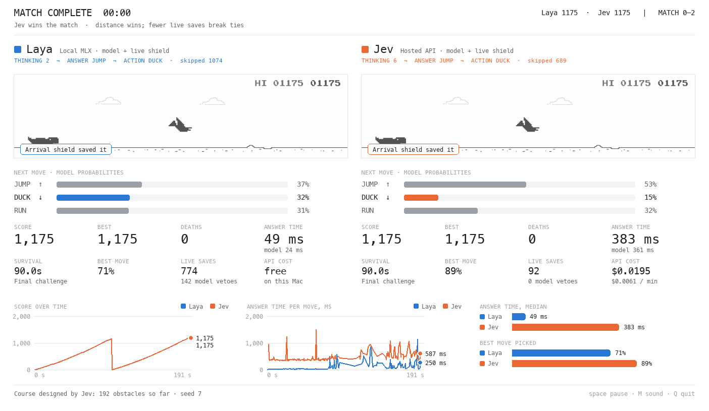
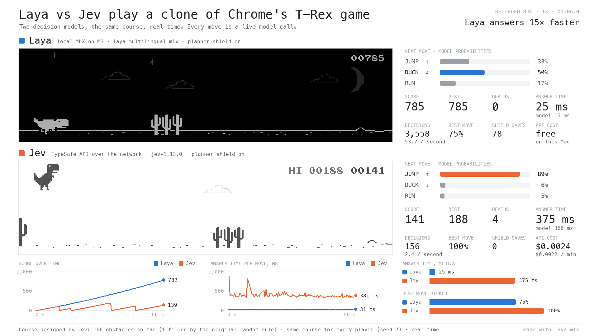

# Laya vs Jev: the Chrome T-Rex game, side by side

Two decision models play a local clone of Chrome's offline dinosaur game at the same time, on the same obstacle course. **Laya** runs on this Mac through MLX. **Jev** is TypeSafe's hosted model, called over the network. Both get the same question for every move and answer with probabilities over `jump`, `duck` and `run`. Neither was trained on the game.



## Run

```bash
uv sync --extra demo --extra trex
uv run --extra demo hf download aac6fef/laya-multilingual-mlx \
  --local-dir models/hub/laya-multilingual-mlx
export TYPESAFE_API_KEY=...        # or: --env-file path/to/.env
uv run --extra trex laya-trex
```

The default show runs **60-second rounds** with a persistent match score. Total distance
earned during the round wins, including distance before a death; equal distance is broken
by fewer live-shield saves, then declared a tie. Both players start the next round together
on the same fresh course. `--rounds 3` ends after three rounds; `--round-seconds 0` restores
endless survival for direct high-score comparisons.

Space pauses, M toggles sound (with `--sound`), Q quits. A JSON comparison is printed when the run ends; `--report FILE` also saves it. Under each game the window shows the model's probabilities for the next move and eight live stats; along the bottom are score over time, answer time per move, and a head-to-head of answer time and how often each model picked the planner's best move.

| Option | Effect |
|---|---|
| `--players laya,jev` | One or two players, left to right. `--players laya` needs no API key with `--course laya` or `--course random` |
| `--course jev\|laya\|random` | Who designs the obstacles. Default `jev` |
| `--jev-inflight N` | Requests Jev keeps in flight (default 6; 1 asks one at a time) |
| `--laya-inflight N` | Questions Laya keeps in flight (default 2) |
| `--lockstep N` | Freeze each game while its model answers, then play N frames per decision. Takes latency out of play |
| `--unassisted` | Execute each model's first choice even when it is marked unsafe |
| `--prompt labeled\|guided` | `guided` also names the recommended action in the state |
| `--round-seconds S` | Round length (default 60); 0 for endless survival |
| `--rounds N` | End after N rounds; default 0 keeps playing |
| `--course-style staged\|original` | Default staged recovery gaps and themed phases; original preserves the old difficulty |
| `--no-replays` | Hide crash replays |
| `--crash-log FILE` | Write full crash diagnostics; `--report` also creates a `.crashes.jsonl` sidecar |
| `--seed N` | Course seed. The same seed gives every player the same course |
| `--headless --duration S` | No window; play for S seconds and print the report |
| `--snapshot FILE` | Save a PNG of the window when the run ends |
| `--record FILE.jsonl` | Record the run as data for `laya-trex export` |
| `--record-seconds S` | Finish recording after S seconds while the live game keeps running |

## Record a video

```bash
uv run --extra trex laya-trex --headless --duration 80 --record artifacts/trex/run.jsonl
uv run --extra trex laya-trex export artifacts/trex/run.jsonl \
  --seconds 66 --output artifacts/trex/demo.mp4 --poster artifacts/trex/demo.png
```

`--record` also works with the window. A recording stores what was on screen as data: every game frame, each model's probabilities and answer times, and wall-clock timestamps. `export` draws it with the same painter as the live window into a 1920 × 1080, 30 FPS H.264 file at the original pace, with `--start` and `--seconds` to cut a clip. Charts always include the whole run up to that moment. It is a rendered replay, not a screen capture; the video is labelled `RECORDED RUN · 1×` and a JSON sidecar says the same. Recording costs the run almost nothing, so video encoding never slows a model down. Outputs are never overwritten. If the system `ffmpeg` is missing or broken, the bundled `imageio-ffmpeg` binary is used.



## The game

`laya_mlx/trex/engine.py` is a Python port of the game in Chromium's `components/neterror/resources/dino_game` (pinned at commit `0fd1c14b`). It keeps the original constants, jump physics, collision boxes, obstacle rules, speed curve, score meter, night mode and sprite sheet, including quirks such as the ducking animation slowing a fall. It advances in fixed 60 FPS steps, so a run is reproducible. It is a clone: nothing runs in Chrome or Chromium.

## What each model decides

A deterministic planner simulates the dino with the engine's own arithmetic and labels each action safe or unsafe, given how long this model's answers take to land. The model sees only text, for example:

```text
state:    Dino runner game. 2 large cacti ahead, 96 px away.
question: Choose the best safe action for the dinosaur.
  jump: Safe. Clears the 2 large cacti. Best.
  duck: Unsafe. Hits the 2 large cacti. Collision.
  run:  Unsafe. Hits the 2 large cacti. Collision.
```

The model's highest-probability action is proposed. By default a shield replaces a choice the planner marked unsafe with the model's most probable safe action, and counts it as a save. Two additional live checks now protect against stale timing: the action is rechecked
when it arrives, and a bounded emergency shield checks for an imminent collision before
each physics step. Motion-changing jumps and airborne inputs are checked beyond the
immediate 12-frame window, up to 42 frames, with bounded delayed-jump alternatives.
These checks can intervene even
when no answer arrives. They are counted separately as `arrival_saves` and `emergency_saves`
and shown as LIVE SAVES. `--unassisted` disables all three shields.

**The live shield can keep a dinosaur alive without model answers.** Higher assisted scores
must not be interpreted as improved model skill. This is a **feature-assisted demo**, like the Snake demo: it measures how fast and how reliably each model reads a labelled situation, not whether it can work out dinosaur physics.

The safety labels are a game against timing. An action is safe only if it survives every landing time in the range recently observed for that model, and leaves a safe action for the next answer too. Tests check the planner against the engine frame by frame, and check that a player choosing at random among safe actions never crashes.

## Watching the match

The top bar shows the round countdown, distance totals, lead, and match wins. Above each
lane, THINKING → ANSWER → ACTION exposes requests in flight, the model's proposal, and the
actual action, including emergency interventions. Survival streaks and short notices mark
perfect jumps, discarded answers, and shield saves. Discards are always counted in the
quiet `skipped` counter. Their brief notices are rate limited to one every five seconds
and cannot replace a recent jump or shield highlight.

After a crash, a two-second buffered view plays at half speed below the live lanes for
four seconds. The race and all model calls continue normally. Recorded exports reproduce
the same inset and decision timing; legacy recordings still render without these fields.
Crash sidecars retain the last 120 physics frames, nearby obstacle positions, requested
versus executed actions, expected versus actual answer timing, and discarded-answer events.

Staged courses open with single obstacles and generous recovery gaps, progress through
Sprint, introduce Bird attack only once the original speed threshold permits birds,
and finish with mixed obstacles in Final challenge. Restarts regain recovery space.
The original physics, spawn legality, and shared-course behavior are preserved. The
model-designed course receives the phase in its prompt; gap floors and bird weighting
also enforce the pacing. Choose `--course-style original` to disable that shaping.

```bash
# Three-round show, with replay data and crash diagnostics.
uv run --extra trex laya-trex --rounds 3 --env-file path/to/.env \
  --record artifacts/trex/show.jsonl --report artifacts/trex/show.json
# Compare 90-second survival scores on the original course difficulty.
uv run --extra trex laya-trex --headless --duration 90 --round-seconds 0 \
  --course-style original --env-file path/to/.env --report artifacts/trex/survival.json
```

## Keeping it fair to a slow model

A model's latency is its own; how often it gets a turn is the harness's choice. Asking one question at a time gives a player one turn per round trip. For Laya that is a turn almost every frame. For Jev, at about 370 ms, it is one turn every 22 frames, while the window in which a jump clears an obstacle is only 18 to 28 frames wide. With one chance per obstacle, Jev died at the first or second one even though it picked the best move every time.

So each player keeps its model busy:

- **Jev keeps several requests in flight**, asked a few frames apart (about four per round trip). A hosted API answers in parallel. Every answer is still a full round trip old, and the planner accounts for that, but Jev now gets a turn every five or six frames.
- **Laya keeps two questions in flight.** One GPU answers one at a time, but the next question is prepared meanwhile. Without this the GPU idles while the planner runs, clocks down, and answers get slower as the game speeds up.

An answer is asked on the premise that the keys stay as they are until it lands. When an answer changes the keys, the ones still in flight were asked about a situation that no longer exists, so they are discarded rather than applied; the report counts them. The safety labels know all of this: waiting is only labelled safe if a safe move exists at every frame where the next question might go out, and after a change of keys the next usable answer is a full round trip away. When no move survives every timing, the labels fall back to a best-effort choice: wait while acting later still works, act once it is the better bet.

What stays unfair is physics. With a third of a second of latency and a landing time uncertain by about eight frames, some obstacle sequences cannot be timed reliably, and those are where Jev still dies.

## The course designer

With `--course jev` or `--course laya`, a model designs the obstacles. For each one it answers a Choice (which obstacle, among those the original rules allow at that speed) and a Score (how much room follows, within the original gap range). The choice is sampled from the model's probabilities with a per-obstacle seed. The designer works ahead of play in a collision-free copy of the game, and every player reads the same stored course. If a player ever outruns the designer, the original random rule fills that slot and the report counts it as a fallback.

Jev is the default designer. Over 40 obstacles on one seed, Jev's obstacle difficulty rose with speed (rank correlation 0.47) and its gaps tightened (-0.56). Laya's were 0.19 and -0.01, close to the original random rule (-0.02). Laya designs in about 50 ms per obstacle and Jev in about 370 ms; the look-ahead hides both.

## Historical measurements on an M3, 16 GB

These measurements predate the multiple-request fairness changes above and are not a
comparison of the current defaults.

90 seconds each, seed 7, Jev-designed course, shield on. The Mac was under heavy memory pressure (16 GB of swap in use), which adds stalls to everything local.

| Real time | Laya (local) | Jev (API) |
|---|---:|---:|
| Answer time, median | **33 ms** | 369 ms |
| Model time, median | 19 ms | 351 ms |
| Decisions | 2,753 | 197 |
| Best score | **257** | 110 |
| Deaths | 4 | 11 |
| Picked the planner's best move | 75% | **100%** |
| Shield saves | 27 | 0 |
| Cost | free | $0.0030 |

| Lockstep, 6 frames per decision | Laya | Jev |
|---|---:|---:|
| Deaths | 0 | 0 |
| Picked the planner's best move | 74% | **100%** |
| Shield saves | 30 | 0 |

In this older run, Jev picked the recommended move every time and Laya answered about
eleven times faster. The single-request schedule and host stalls prevent using these
results to judge the current system. Reports: `artifacts/trex/*.json` after a run.

A Jev request for one move is about 350 input tokens. Cost depends on request frequency;
use the report's token count and estimated `usd` rather than the old single-request
run's cost per minute.

## Latest assisted match (2026-09-21)

The completed validation used two 90-second rounds, seed 7, staged Jev-designed course,
and all three shields. Both players survived both rounds without a death or API error.

| Metric | Laya | Jev |
|---|---:|---:|
| Round 1 distance | 1,169 | 1,169 |
| Round 2 distance | 1,175 | 1,175 |
| Deaths | 0 | 0 |
| Match wins | 0 | 2 |
| Arrival / emergency interventions | 705 / 69 | 18 / 74 |

Jev won the equal-distance tie-breaks with fewer live interventions. These counts are
interventions, not uniquely identified lives saved. The stronger shield and staged course
contribute to the higher scores. This is a show result, not evidence of better model skill.
The host dropped 5.83 seconds of stalled time; do not treat it as a clean latency benchmark.
There were no course fallbacks or course errors.

Raw validation recordings and videos are local artifacts and are not bundled with the
repository. Reproduction cases extracted from those runs are included in
`tests/fixtures/trex_live_arrivals.json`. The default round duration remains 60s;
use `--round-seconds 0` for endless survival.

## Earlier live smoke test (2026-09-21)

One 90-second windowed run, seed 7, default in-flight settings, Jev-designed course:

| Metric | Laya | Jev |
|---|---:|---:|
| Best score | 803 | 417 |
| Deaths | 3 | 3 |
| Answer latency p50 | 32.7 ms | 373.3 ms |
| Planner latency p50 / p95 | 0.7 / 2.3 ms | 6.0 / 28.6 ms |
| Best-effort applied decisions | 0 | 23 |
| Backend errors | 0 | 0 |

No dropped host time, course errors, or random course fallbacks were reported. The run
completed and its processes exited. This validates operation, not a stable performance
ranking or a fix for the previously observed restart deaths. Both players still died;
zero best-effort decisions does not guarantee survival when actual answer timing falls
outside the planner's assumed range.

The raw smoke-test artifacts are not bundled with the repository. The report's estimated
combined hosted cost was $0.017595, including course design.

## Planner performance and diagnostics

Run the deterministic benchmark without loading either model or calling the API:

```bash
.venv/bin/python -m scripts.benchmark_trex_planner
```

It exercises 366 snapshots across single-request and staggered-request timing. Compare
`output_sha256` before comparing speed: the same hash means all serialized plan outputs
match for this workload. The horizontal collision prefilter reduced total time from
1,290 ms to 564–600 ms in local checks (about 2.2× faster); this is a planner measurement,
not an end-to-end model speedup. Physics differential and survival tests cover correctness
beyond these benchmark snapshots.

Reports include `planner_ms_p50`, `planner_ms_p95`, and `best_effort_decisions` for applied
answers. A best-effort decision means the planner could not prove a safe move across the
full timing range. Recordings include `robust` and `plan_states` for the last applied answer,
alongside planner and model latency. These fields help distinguish expensive planning,
network delays, and timing ranges that cannot be handled safely.

Before comparing live players, check host load and swap, let the host settle after tests,
and collect three 90-second runs a minute apart. Inspect `host_stall_seconds_dropped`,
errors, discarded answers, and best-effort counts alongside score. A single live run is
a smoke test, not evidence of a stable winner.

## Attribution

Game rules, sprite sheets and sounds come from The Chromium Authors under the BSD 3-Clause license; see `laya_mlx/trex/assets/LICENSE.chromium`. Jev is a TypeSafe model; see <https://docs.typesafe.ai>.
